# Summer Kindness Camp

[View the live project here](https://iama3191.github.io/Summer-kindness-camp/)

## ABOUT THE PROJECT 

Summer Kindness Camp is an unreal project created for my PP1 with Code Institute.
Summer Kindness Camp is a project for children focused on helping them bring more kindness and love to those in need while participating in social programs for a week during the summer. Each day targets a different concern with multiple activities inside and outside the facilities in Zagreb, Croatia. 
The main goal of this project is for kids to get knowledge of social problems in the world and how they can make a difference even with a small gesture.

The social programs are: 

1. Senior's Program focuses on seniors living in nursing homes.

2. Protector's Program focuses on recycling and the environment.

3. Animal's Program focuses on abandoned pets living in shelters.

4. Cooking's Program focuses on people without homes.

5. Sport's Program focuses on kids living in an orphanage.

## ABOUT THE WEBSITE

The one-page website is a colorful and straightforward experience for parents searching for a new and meaningful opportunity for their kids to grow up during the summer. It includes a top menu for easy navigation, general information about the camp, a description of the social programs with a specific schedule, a gallery's photos of different events and activities, a contact form, and a footer with social media information. 

## INDEX

[User Experience (UX)](#user-experience-ux)

[Designs](#designs)

[Technologies used](#technologies-used)

[Features](#features)

[Testing](#testing)

[Deployment](#deployment)

[Credits](#credits)

## USER EXPERIENCE (UX)

### STRATEGY

Reasons for this website:

* Create a solid relationship with the different foundations and organizations participating in the project.

* Create a well-structured UX design to achieve the use of the form at the end of the website.

Reasons a user may visit the website:

* Find new adventurous activities for children during working hours during the summer.

* Show a different perspective to their children about social concerns and what they can do to help.

* Look for a summer camp for kids from 8 years in Zagreb.

* Look for a detailed list of daily activities for the kids.

### SCOPE

What a user may expect:

* Easily navigation through the website.

* Consistent design and presentation in all screen sizes. 

* Links work as expected.

* Information about the camp and a detailed schedule. 

* A way to get in contact for more details. 

What a user may want:

 * To watch photos of previous camp weeks.

 * To find which foundations and organizations participate in the project.

 * To find social media links.

### STRUCTURE

The one-page website has:

*    Home section:  With a hero image and the title of the project.

* About section: with a description of the camp, for whom the camp is, and the main goal. 

*   Program section: General information of each social Program and a typical daily schedule.

* Gallery section: Photos of previous years.

*  Contact section: With a form to request more info.

## DESIGNS

### IMAGES

The hero-image and the form's background have been chosen because they are joyful, bright, and colorful like the summer. They have colors in common that are used for the general style of the website without distracting the user and complementing themselves in a very playful way. 

### COLOR SCHEME

The color scheme is based on the two most significant images on the website (the hero image and the form image). The Safety Yellow, the Safety Orange Blaze Orange, and the Medium Aquamarine make a perfect match for bringing the website to life. The Ivory is for the body's background for a simple look, and the shade Rich Black FOGRA 39 is for the font. 

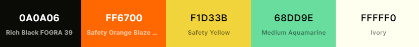

### TYPOGRAPHY

Fonts 'Lato' and 'Sniglet' were imported from Google Fonts. 'Sniglet' is used in all the headings (h1, h2, and h3), table's caption, and the form's button because it looks informal but at the same time easy and unique.
'Lato' is used for the rest of the text because it is effortless to read.

## TECHNOLOGIES USED

1. Languages used:

    * HTML5

    * CSS

2. Libraries and programs used:

    * [Microsoft Paint 3D: ](https://www.microsoft.com/en-us/p/paint-3d/9nblggh5fv99#activetab=pivot:overviewtab) Was used for resizing  and editing images.

    * [Google Fonts:](https://fonts.google.com/) Was used to import fonts 'Lato' and 'Sniglet.'

    * [Coolors:](https://coolors.co/) Was used to find the color scheme from a photo and check the color contrast between the background and the text. 

    * [Font Awesome:](https://fontawesome.com/): Was used to add icons for a more playful website.

    * [TinyPNG:](https://tinypng.com/) Was used to compress images.

    * [FreeConvert:](https://www.freeconvert.com/) Was used to convert images from JPG to WEBP.

    * [Formspree](https://help.formspree.io/hc/en-us) Was used to give the form an action attribute. 

    * [Favicon Generator:](https://favicon.io/favicon-generator/) Was used to create the favicon for the tab.

    * [Git:](https://git-scm.com/) Was used for version control by employing the Gitpod terminal to commit to Git and Push to GitHub.

    * [GitHub:](https://github.com/) Was used as the repository for the project's code after being pushed from Git.
    * [Beautifier:](https://beautifier.io/) Was used to organize in a better way the codes.

    ## FEATURES

* ### CALL TO ACTION  
   
   I made the call to action visible to get the user's attention.

    - For the navigation bar,  when the mouse hovers the word in the hamburger menu,  the color changes, but when it is on wider screens,  the word is underlined.

    - When the user focuses on any form input, the background's color changes, and for the "REQUEST INFO" button, the background's color changes when the mouse hovers over.

    - The background's color changes when the mouse hovers over the social media icons. 

    - The social media links open in a new tab for better UX.

 * ### NAVIGATION BAR

A hamburger menu for small screens until 800px was created with CSS. It is shown in a column divided into sections. For bigger screens, the navigation bar changes into a horizontal display of the same areas in the same order: Home, About, Program, Gallery, and Contact. The navigation bar has a sticky position to avoid scrolling up and down. 
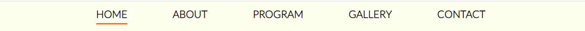
  

 

* ### HOME SECTION
    This section features a hero image with the main title centered, and its shows in the same way in every screen size. The purpose of the hero image is to make an emotional impact on the user and make them stay longer.

    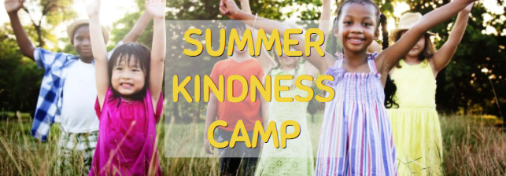

* ### ABOUT SECTION
    This section features two parts: The first one has three cards with general information about the camp, and the second one, has the name of the reinforced values during the camp. Both parts are shown in rows for the wider screen, and they are in columns for small devices.     

    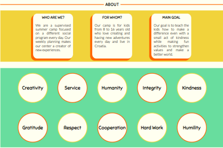

* ### PROGRAM SECTION
    This section also has two parts: The first one features five cards with each social Program and its explanation. Every title has an icon to add a little bit of fun, and in the top-right corner is the number of the day on which the activity is happening to give the user more information in a playful way.

    The second part features a table with the specific schedule of the "TYPICAL DAY" at the camp. It's divided into three columns: time, activity, and description. 

    The table's width changes for every screen size while maintaining its general structure. 

     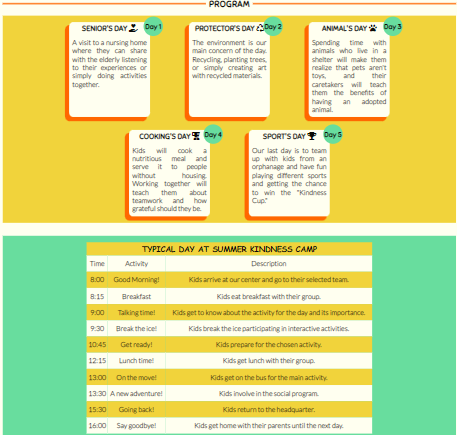

* ### GALLERY SECTION

    This section features 12 photos arranged into one column for smaller devices (from 320px), two columns for medium devices (550px), and three for wider screens (from 1270px). 

* From 320px devices  
    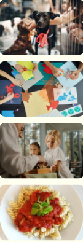

* From 550px devices 
    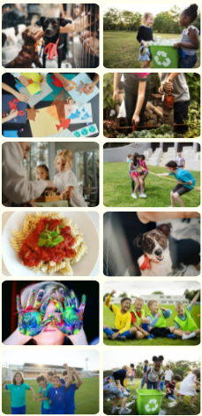

* From 1270px devices  
    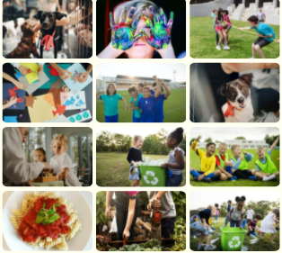

* ### CONTACT SECTION
    This section has a form for requesting more info, and it only asks the user: first name, last name, email address, and any comment or feedback. It's a short form to allow the user to give only the essential information he is willing to share. Every text field is required, so if any input is empty, it will ask to complete the blank space. Also, I added a placeholder to every empty input.

    The form has method= "post"  and action="https://formspree.io/f/xpzbqalv" for collecting data. Every user's data is sent to the selected email.

  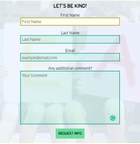

* ### FOOTER
    This area features the social media icons with links that open in a new tab for better UX and copyright information.

    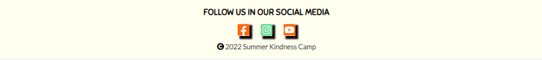

   ## TESTING

1. VALIDATORS
    * [MARKUP VALIDATION SERVICE:](https://validator.w3.org/) didn't show any errors from the code.

    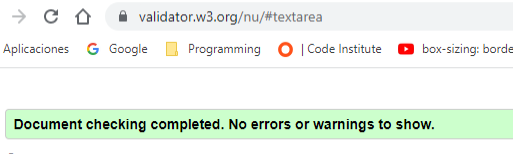
     

    * [CSS VALIDATION SERVICE:](https://jigsaw.w3.org/css-validator/) didn't show any errors from the code, only a warning indicating:  "imported style sheets are not checked in direct input and file upload modes." This warning refers to the imported fonts from Google Fonts.

    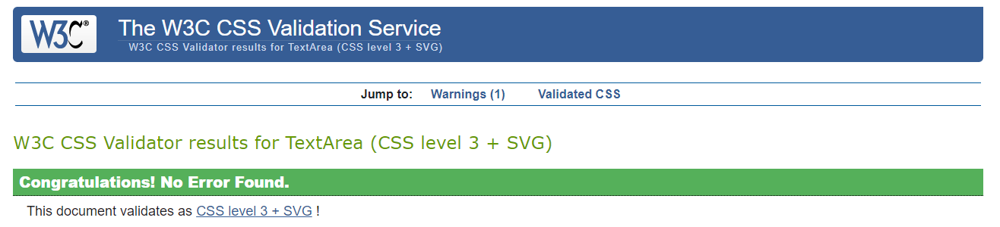
    
    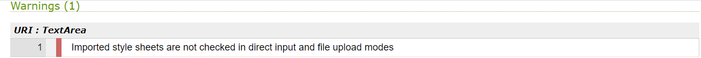
  

2. BROWSERS

I tested how the website looks in these different browsers while using Google Chrome as the main browser for testing and the DevTools for any appropriate change.

- Google Chrome Version 97.0.4692.99 (Build Oficial) (64 bits)

- Mozilla Firefox Version 96.0.2 (64-bit)

- Microsoft Edge Version 97.0.1072.69 (Official Build) (64-bit)

The website's presentation doesn't change in the browsers except for the font in Mozilla Firefox. The 'Lato' font looks smaller and bolder.

Google Chrome  
    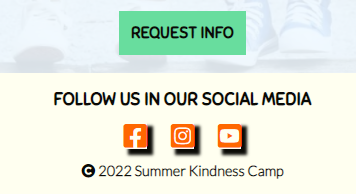
    

Mozilla Firefox  
    

Microsoft Edge  
    

The website is responsive in all the browsers without any issue and maintains the whole structure from a 320px screen.

3. LIGHTHOUSE

I used Lighthouse for testing: Performance, Best Practices, Accessibility, and SEO.

  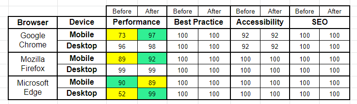

The previous chart shows the results from Lighthouse from the different browsers, and the comparison before and after adding the 

   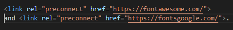

These were suggestions to improve the mobile performance in Google Chrome, and they worked; the performance went from 73 to 97. Mozilla Firefox also shows an improvement, from 89 to 92. Microsoft Edge offers a different result for mobiles, from 90 to 89, but for desktop went from 52 to 99.   
These tests are from regular navigation tabs. In the incognito mode, results were above 90.

* Google Chrome  
    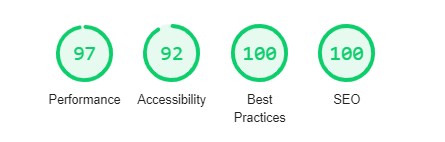

* Mozilla Firefoz  
    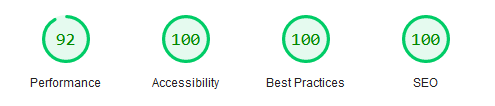

* Microsoft Edge  
    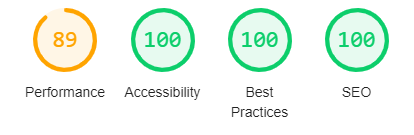

The Grammarly extension causes the result for Google Chrome accessibility of 92. 
    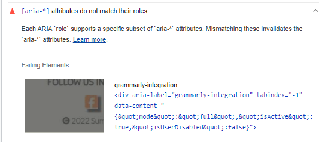

Google Chrome was the only browser that warned about how extensions could affect the website's performance. For these reasons, the Accessibility score changed in private mode to 100.
 
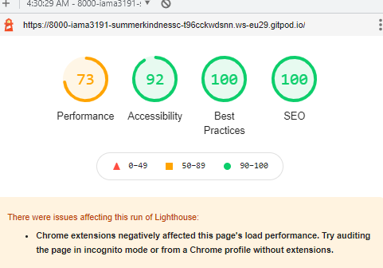
     

4. FORM TESTING

As I mentioned before, the form has method= "post"  and action="https://formspree.io/f/xpzbqalv" for collecting data. 
So, I proceeded to test the form by adding my personal information to request more information, and it worked properly.

1. I filled in the requested inputs and click "REQUEST INFO"
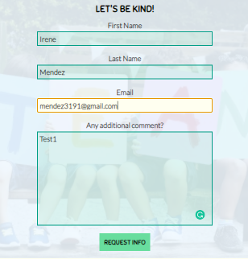

2. Redirect me to a different page to inform me that the form was submitted successfully and with an optional "Go Back."
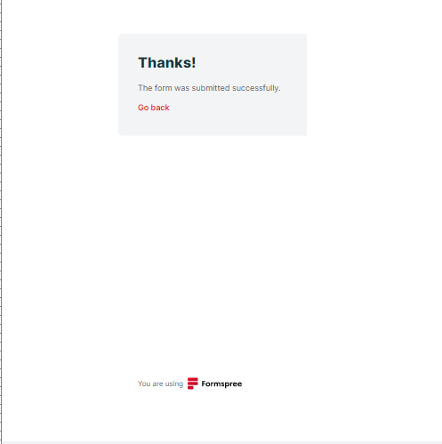

3. I received an email with all the user's submitted information because this is established in my Formspree's account.
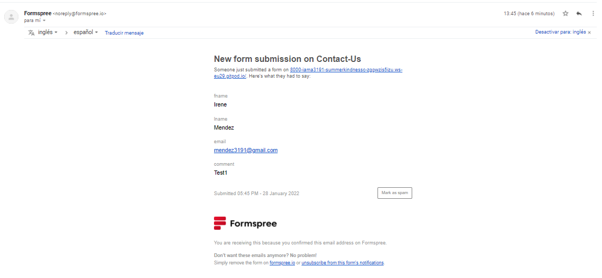

## ISSUES DURING TESTING

I wrote the CSS code first for small screen devices (from 320px), specifically for iPhone 5/SE, and I have noticed that sometimes it may look like an overflow is present, but after checking the code and refreshing the page, it doesn't show any overflow. This case is very sporadic, and I don't know why it's happening. I use the ["Unicorn Revealer"](https://chrome.google.com/webstore/detail/unicorn-revealer/lmlkphhdlngaicolpmaakfmhplagoaln) extension to see any overflow, and didn't show any.

My mentor Brian Macharia tested in his computer and looked good. Probably this is a Google Chrome issue.

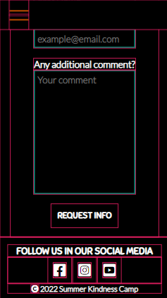
 
## DEPLOYMENT

* ### HOW THIS SITE WAS DEPLOYED 

1. In the GitHub repository of the website, go to the "Settings", and click.

2. In the menu on the left side of the screen, go to the "Code and Automation" and click on "Pages".

3. Under the GitHub Pages,  select the Main Branch from the dropdown menu.

4. Optionally select the folder in the following dropdown menu.

5. Save and automatically the site is published. 

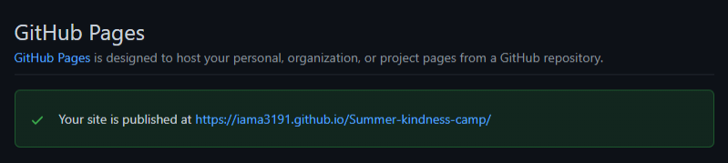

* ### HOW TO FORK THE REPOSITORY

1. Go to the website's repository on Github.

2. Go to the "Fork" button on the right side of the screen and click.

3. Now you have a copy of the repository into your own GitHub account to make changes without affecting the original repository.

* ### HOW TO CLONE THIS SITE

1. Go to the website's repository https://github.com/iama3191/Summer-kindness-camp  on GitHub.

2. Click the "Code" button on the left side of the green "Gitpod" button.

3. Click the HTTPS and copy the link.

4. Open Gitbash.

5. Change the current working directory to where you want the cloned directory to be.

6. Type git clone, and then paste the URL you copied earlier.

7. To make changes to the website: 

    7.1. Update the code as needed.

    7.2. Go to the terminal and add <em>git add .</em>

    7.3. Add <em>git commit -m "brief description of the update"</em>

    7.4. Add <em> git push </em> 

    Any updates commited to the Main Branch inmediately reflect in the hosted site.
## CREDITS

* ### CONTENT

Irene Mendez created and edited all the text shown on the website using [Grammarly](https://app.grammarly.com/). 

* ### CODE

  * The hamburger menu for the small screens using only HTML and CSS  was taken initially from [Create a responsive navigation nav with no JS!
](https://codepen.io/kevinpowell/pen/jxppmr) by [Kevin Powell.](https://www.kevinpowell.co/)

  * The color of the table in the Program's section was taken from [W3 Schools](schools.com/cssref/sel_nth-child.asp) using CSS:nth-child() Selector.

  * The code to maintain the title center inside the container was taken from [W3 Schools](https://www.w3schools.com/css/tryit.asp?filename=trycss_align_transform) using transform and position.

  * The CSS style for the gallery was initially taken from the project [Love Running](https://github.com/Code-Institute-Org/love-running-rebuild/blob/master/unit-18-added-gallery-contents/assets/css/style.css) by [Code Institute](https://codeinstitute.net/global/) and edited for this project.

* ### MEDIA

   * All the photos used in this project were from [rawpixel](https://www.rawpixel.com/)  and [pexels](https://www.pexels.com/es-es/).

## ACKNOWLEDGMENTS

 * I received the inspiration for this project from my daughter and how I want her to perceive the world. I left my country and family four years ago because of the social-political crisis, and I haven't returned. I have faced many obstacles in this period, and I wasn't prepared for that. I want her to know how lucky she can be, but at the same time, the problems in the world and that it only takes a small gesture to make a difference and change somebody's world.

 * My mentor Brian Macharia guided me in all my concerns and introduced me to the CSS Evangelist, Kevin Powell.  He helped me understand how I can create a hamburger menu without JavaScript.

  ## Disclaimer
  
The content of this Website is for educational purposes only.

